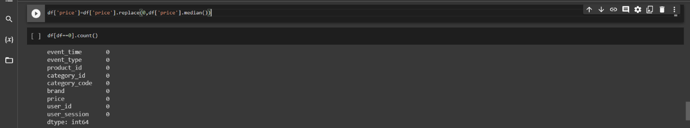
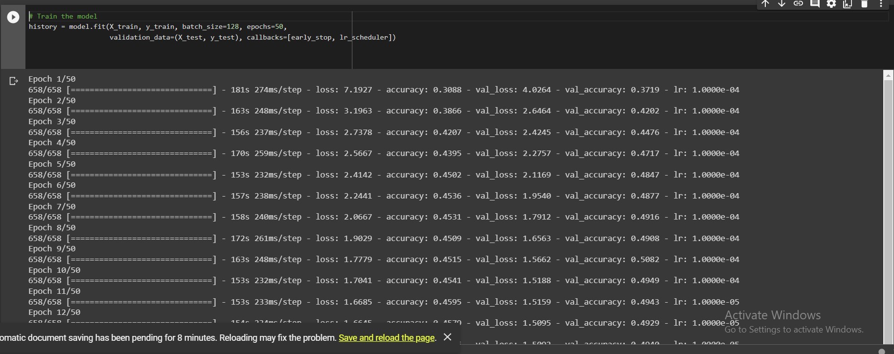
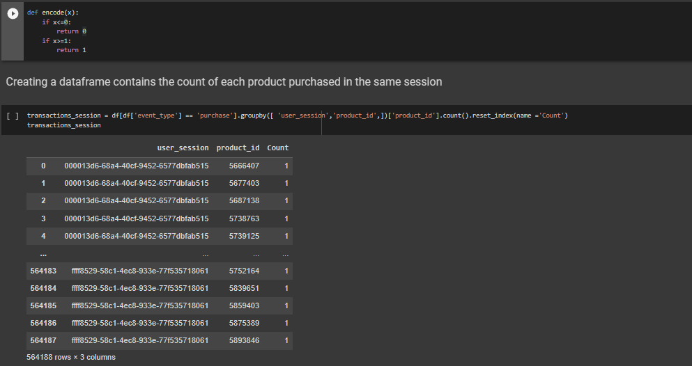
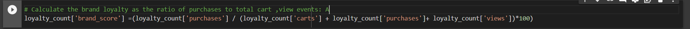

# Ecommerce_Behavior_DOCUMENTAION

This project is about an e-commerce platform that provides various features such as online storefronts, shopping carts, payment gateways, and order management systems. The data provided is from a medium cosmetics online store hosted by REES46 niche-specific personalization engine Platform. The data contains behavior data for two months (October and November 2019) and each row in the file represents an event. All events are related to products and users. The file structure includes properties such as event time, event type, product ID, category ID, category code, brand, price, user ID and user session. The business requirements section mentions that the data can be used to support the business in various ways.

### DASHBOARDS LINK
https://app.powerbi.com/view?r=eyJrIjoiNzBiOGUxMjgtNTkwMy00YWUwLWI2YTAtNmVmYjJiZDY0NzA4IiwidCI6ImJhYzk0Y2Y0LTdkMjAtNDNhNC05NzFjLThhOTgxNWExZDE3ZiJ9

# **Table of Contents**

> ### [Overview ](about:blank#overview)

#### [File structure ](about:blank#file-structure)

#### [Business Requirements](about:blank#business-requirements)

#### [Workflow ](about:blank#workflow)

#### [Work Deliverables ](about:blank#work-deliverables)

### [Libraries Used ](about:blank#libraries-used)

### [Work Procedures ](about:blank#work-procedures)

- **1. Ecommerce Data_Validation** 
- **2. Ecommerce Predicting_brand_col_RandomForest** 
- [**3. Ecommerce CNN_brand_Prediction** ](about:blank#ecommerce-cnn_brand_prediction)
- [**4.** **Ecommerce Data_Preprocessing** ](about:blank#ecommerce-data_preprocessing)
- [**5.** **Ecommerce Data_Manipulation** ](about:blank#ecommerce-data_manipulation)
- [**6.** **Ecommerce RFM_Analysis** ](about:blank#ecommerce-rfm_analysis)
- [**7.** **Ecommerce Association_Rules** ](about:blank#ecommerce-association_rules)
- [**8. Ecommerce Recommendation_System** ](about:blank#_Toc131245101)
- [**9. Ecommerce Brand_Loyality** ](about:blank#ecommerce-brand_loyality)

### [Dashboard 1 (Ecommerce Products & Brands Sales) ](about:blank#dashboard-1-ecommerce-products-brands-sales)

- [1. Event type Percentage Chart ](about:blank#event-type-percentage-chart)
- [2. Average price of product for each event type ](about:blank#average-price-of-product-for-each-event-type)
- [3. Top 10 brands in Number of Purchases. ](about:blank#top-10-brands-in-number-of-purchases.)
- [4. Card Visuals to show: ](about:blank#card-visuals-to-show)
- [5. Sales Distribution for each Week Day per hour ](about:blank#sales-distribution-for-each-week-day-per-hour)
- [6. Sales of each week of Month Per day ](about:blank#sales-of-each-week-of-month-per-day)
- [7. Sales count for each Month per time ](about:blank#sales-count-for-each-month-per-time)
- [8. Average price for Most price variance products per time ](about:blank#average-price-for-most-price-variance-products-per-time)

### [Dashboard 2 (Ecommerce Customers’ Segments) ](about:blank#dashboard-2-ecommerce-customers-segments)

- [1. Card Visuals to show: ](about:blank#card-visuals-to-show-1)
- [2. Tree Map of Customers Segments ](about:blank#tree-map-of-customers-segments)
- [3. Purchasing Count of top 5 brands per each segment. ](about:blank#purchasing-count-of-top-5-brands-per-each-segment.)

### [Final Insights ](about:blank#final-insights)

E-commerce refers to the buying and selling of goods or services through electronic means, primarily over the internet. It has revolutionized the way people conduct business by enabling consumers to shop from anywhere and at any time, and businesses to reach a global audience. E-commerce platforms provide various features such as online storefronts, shopping carts, payment gateways, and order management systems, among others. The industry has seen tremendous growth in recent years, driven by advancements in technology, increasing consumer demand for convenience and flexibility.

# **Overview**

This file contains behavior data for two months (October and November 2019) from a medium cosmetics online store hosted by REES46 niche-specific personalization engine Platform. Each row in the file represents an event. All events are related to products and users. Each event is like many_to-many relation between products and users. A session can have multiple purchase events if it's a single order.

## **File structure**

| Property | Description |
| --- | --- |
| event_time | •     Time when event happened at (in UTC). |
| event_type | • view- a user viewed a product
• cart - a user added a product to shopping cart
• remove_from_cart- a user removed a product from shopping cart
• purchase - a user purchased a product |
| product_id | • ID of a product |
| category_id | • Product's category ID |
| category_code | • Product's category taxonomy (code name) if it was possible to make it. Usually present for meaningful categories and skipped for different kinds of accessories. |
| Brand | • Down cased string of brand name. |
| Price | • Float price of a product. Present. |
| user_id | • Permanent user ID. |
| user_session | • Temporary user's session ID. Same for each user's session. Is changed every time user come back to online store from a long pause. |

## **Business Requirements**

You can support the business in various ways including and not limited to:

1. the marketing department need your help to identify the following :
    1. which products to feature in the next advertising campaigns and promotions?
    2. Which brands are customers most loyal to?
    3. Who are the most valuable customers based on their purchase history.
    4. Are there any price trends for a particular product over time?

2. Define a KPI that measures customer loyalty from the data.

3. Design a sample recommendation engine using association analysis, and what metrics would you use to evaluate its performance?

## **Workflow**

1. Data Validation
2. Data Preprocessing & Feature Engineering
3. Data Exploration
4. Data Manipulation
5. RFM Analysis & Customer Segmentation
6. Association Rule
7. Recommendation System
8. Dash Board Creating
9. Final Insights

## **Work Deliverables**

There is 9 Notebooks containing the Project work as following

1. Ecommerce Data_Validation
2. Ecommerce Predicting_brand_col_RandomForest
3. Ecommerce CNN_brand_Prediction
4. Ecommerce Data_Preprocessing
5. Ecommerce Data_Manipulation
6. Ecommerce RFM_Analysis
7. Ecommerce Association_Rules
8. Ecommerce Recommendation_System
9. Ecommerce Brand_Loyality
10. Dashboard 1 (Ecommerce Products & Brands Sales)
11. Dashboard 2 (Ecommerce Customers’ Segments)

# **Libraries Used**

- NumPy:
    - A library for working with arrays of numerical data.
- pandas:
    - A library for data manipulation and analysis. It offers data structures and operations for manipulating numerical tables and time series.
- matplotlib:
    - A plotting library for creating static, animated, and interactive visualizations in Python.
- seaborn:
    - A library for statistical data visualization based on matplotlib. It provides a high-level interface for drawing attractive and informative statistical graphics.
- SciPy:
    - A library for scientific computing and technical computing.
- missing no:
    - A library for visualizing missing data in a dataset.
- datetime:
    - A module that supplies classes for manipulating dates and times.
- chart_studio.plotly:
    - An interactive, browser-based charting library built on the open source JavaScript graphing library plotly.js.
- plotly.graph_objs:
    - An interface to plotly’s low-level graph objects.
- cufflinks:
    - A library that binds the power of plotly with the flexibility of pandas for easy plotting.
- IPython.core.interactiveshell:
    - A module that provides an enhanced interactive Python shell.
- plotly.io:
    - A module that provides functions for rendering figures into various formats.
- warnings:
    - A module that provides the ability to issue warning messages to users.
- sklearn.ensemble:
    - A module that provides ensemble-based methods for both classification and regression. Ensemble methods use multiple learning algorithms to obtain better predictive performance than could be obtained from any of the constituent learning algorithms alone.
- category_encoders:
    - A library that provides a suite of scikit-learn compatible transformers for encoding categorical variables in various ways.
- sklearn.preprocessing:
    - A module that provides several common utility functions and transformer classes to change raw feature vectors into a representation that is more suitable for the downstream estimators.
- sklearn.model_selection:
    - A module that provides utilities for model selection and evaluation.
- keras:
    - A high-level neural networks API, written in Python and capable of running on top of TensorFlow, CNTK, or Theano.
- tensorflow:
    - An open-source software library for dataflow and differentiable programming across a range of tasks. It is a symbolic math library and is also used for machine learning applications such as neural networks.
- mlxtend:
    - A library that provides a collection of extensions and tools for data science and machine learning tasks in Python. The `frequent_patterns` module provides functions for mining frequent itemsets and association rules from transactional datasets.
- surprise:
    - A Python scikit for building and analyzing recommender systems. It provides various ready-to-use prediction algorithms and tools for building custom algorithms.

# **Work Procedures**

## **1.** **Ecommerce Data_Validation**

- Loading the data from two files “Data1.csv”, and “Data2.csv” , Then concating them into a DataFrame called “Data”
- Displaying the “Data” DataFrame
    
    
    
- The data contains 8.7 M records and 9 columns.
- Counting the Unique values for each column.
    
    
    
- Checking For Nulls for each column and getting Its percentage
    
    
    
    - There is 3 columns with missing values
        - Category_code: 98.36% Missing Values
        - Brand : 41.72% Missing Values
        - User_session: 0.02% Missing values
- Visualizing the missing values using Missingno to get better understanding
    
    
    
- Then we count the zeros in the data so we can check if there is any zero values that doesn’t make sense.
    
    
    
- There is around 17.6 K zeros in the price colum

After the data Exploration, We have missing values in 2 significant columns [ category_code, brand ],

There is 17.6K zeros in the price column which can be:

1. Missing values that have been filled with zero
2. Offers to get an item/s for free after buying some other items

We will start by dealing with the Brand column.

## **2.** **Ecommerce Predicting_brand_col_RandomForest**

- For Predicting the Brand column missing values we will use the same original in the two files ‘Data1.csv’, ‘Data2.csv’
- We will start by taking a sample of 1M records from the data to check the accuracy on the model on it so we can know that if the model is can be used to classify the unknown records to a brand.
    - The sample we are testing the model on has around 41% missing values in the brand column like the whole data.
        
        
        
    - The Y is the Brand Column
    - The X Features are
        - X = df[['product_id', 'category_id', 'price']]
    - Taking the part of the sample that has only brand and splitting it into train and test data
        - 20% test data
        - Data splitted using
            - from sklearn.model_selection import train_test_split
            - X_train, X_test, y_train, y_test = train_test_split(X, y, test_size=0.2, random_state=42)
        - Running the model to test the accuracy
            - from sklearn.ensemble import RandomForestClassifier
            - rfc = RandomForestClassifier()
            - rfc.fit(X_train, y_train)
            - y_pred = rfc.predict(X_test)
            - acc_rfc = round(rfc.score(X_train, y_train) * 100, 2)
            - print(acc_rfc,"%")
        - The Accuracy we got from the RandomForest Classifier is
            
            
            
        - The 100% accuracy may look like over fitting but the classification is just very straight forward.
        think of it as a huge If else statement.
- Starting to use the model to classify the records with no brand
    - Since the Accuracy of the RandomForest Classifier algorithm in predicting the missing value in a 1M rows data sample is 100%, Then we can predict the missing values in the column 'brand' after spliting the data into parts around 1.5M each to make it easier for the algorithm as for this accuracy there is no point of using the whole data in one time./code
        
        
        ```python
        # The parts are ds1, ds2, ds3, ds4, ds5, ds6
        ds1 = data1.iloc[:1500000, :]
        ds2 = data1.iloc[1500000 : 3000000, :]
        ds3 = data1.iloc[3000000: , :]
        ds4 = data2.iloc[:1500000, :]
        ds5 = data2.iloc[1500000 : 3000000, :]
        ds6 = data2.iloc[3000000: , :]
        ```
        
        - 1st we start by checking the model accuracy for each part like we did before for the sample( same procedure)
            
            ```python
            ds1.loc[ds1['brand'].isnull(),'brand'] = 'no brand'
            ds11 = ds1[ds1["brand"]!= 'no brand']
            y = ds11['brand']
            X = ds11[['product_id', 'category_id', 'price']]
            X_train, X_test, y_train, y_test = train_test_split(X, y, test_size=0.2, random_state=42)
            rfc = RandomForestClassifier()
            rfc.fit(X_train, y_train)
            y_pred = rfc.predict(X_test)
            acc_rfc = round(rfc.score(X_train, y_train) * 100, 2)
            print(acc_rfc,"% accuracy for ds1")
            ```
            
            - Again we got the same accuracy of 100% as we said It just like a huge IF else Statement.
        - 2nd we start using the model for filling the brand column.
            
            ```python
            from sklearn.ensemble import RandomForestClassifier
            brandNull = ds1[ds1["brand"] == 'no brand']
            brandNotNull = ds1[ds1["brand"]!= 'no brand']
            brandColumns = ['product_id', 'category_id', 'price']
            rfModel_brand = RandomForestClassifier()
            rfModel_brand.fit(brandNotNull[brandColumns], brandNotNull["brand"])
            brandNullValues = rfModel_brand.predict(X= brandNull[brandColumns])
            brandNull["brand"] = brandNullValues
            ds1 = brandNotNull.append(brandNull)
            ds1.reset_index(inplace=True)
            ds1.drop('index', inplace=True, axis=1)
            ```
            
    - performing the same 2 steps for the rest of the 6 parts and concating them we will have the complete data in one DataFrame with the brand column in completely classified.
        
        ```python
        data = pd.concat([d1, d2, d3, d4, d5, d6])
        ```
        
- After getting the whole data in one DataFrame with the a complete brand column we need to export it in a csv file so we can use it in the next steps in our project.
    
    ```python
    data.to_csv('dataPredicted_RandomForest.csv', index = False)
    ```
    

## **3. Ecommerce CNN_brand_Prediction**

This column has around 41% missing brand from its total brand

There are several methods to fill missing values in Python, and each method has its advantages and disadvantages. Here are some common methods:

Mean/median/mode imputation:

This method involves replacing missing values with the mean, median or mode of the available data. This method is easy to implement and can work well for small amounts of missing data. However, it may not be suitable for larger amounts of missing data such as our case, as it can distort the distribution of the data.

Forward/Backward fill:

This method involves propagating the last observed value forward (or backward) to the next missing value. It is useful when missing data occurs in sequences, such as time series data. However, this method may not work well if the missing values occur at the beginning or end of the data.

Interpolation:

This method involves estimating missing values based on the surrounding data points. There are different types of interpolation methods such as linear, quadratic, cubic, and spline interpolation. Interpolation methods can work well when the data is smooth and the missing values are not too large. However, if the data is noisy or the missing values are too large, interpolation methods may not be accurate. we cannot use in our case

KNN imputation:

This method involves using a machine learning algorithm to predict missing values based on the surrounding data points. KNN imputation can work well for small to medium-sized datasets and can handle non-linear relationships between variables. However, it can be computationally expensive for large datasets, and the accuracy may depend on the choice of K value.

Deep learning:

Deep learning methods can be used to predict missing values using neural networks. This approach can work well for large datasets with complex relationships between variables. However, it can be computationally expensive and requires a lot of data to train the model.

Therefore, we decided to use deep learning to predict those values because our data has big number of rows about 9000000

We used DNN with 4 hidden layers a 50 epochs.

1-First we have about 17500 zero in price column, we decide to fill with median, because this column right skewed that is mean this column has outliers.



2-encoding the data and replace the value that express the nan after encoding which is 236


3-standardized data before model to help the optimization algorithm to reach

to global minima.


4-Define the DNN model and combine the model


5-train and run the model



7-Predict the missing brand


"This model works well until it reaches epoch 38, then it decides to stop, and I don't know why. Anyway, we have reached an accuracy that is not good at all, which is 51%. Therefore, we decided to use another algorithm, which is Random Forest.”

## **4. Ecommerce Data_Preprocessing**

### event_time

1- splitting the "Datetime" column into "date", "hour" , "year" columns

2- Getting the "weekday", "month" columns out of "date" column

### category code

1. filling category code missings with (other) category
2. Do encoding using ONE HOT ENCODING.

### Event_type

> 1. Apply Encoding Using ONE HOT ENCODING
> 
> 
> 2. purchase column ONE HOT ENCODING
> 
1. Renaming purchase encoded column to (yes_purchase) and (no_purchase)

## **5. Ecommerce Data_Manipulation**

### Price column

- We have 37 negative values in price column which may returned product

### Event_type column

- PLOT THE PERCENTAGE OF EACH EVENT


- CALCULATE THE NUMBER OF VIWES

no. of views in all brand = 693009

- CALCULATE THE NUMBER OF CART

no. of cart in all brand = 210620

- CALCULATE THE NUMBER PURCHASES

no. of purchases in all brand = 52523

TOP PURCHASED

> 
> 
- COMPARE PURCHASES BETWEEN OCTOBER AND NOVEMBER

November 1531016.90 & October 1211538.43

- USER EVENT BY MONTH


### PRODUCT_ID COLUMN

- WE HAVE 45960 product.

> CALCULATE THE MEAN SALES MADE BY EACH PRODUCT
> 


- Top 30 products

> 
> 
- Trends in products

Explore IF THERE are ANY TRENDS IN THE PRODUCT SALES IN A SPECIFIC DAY OR A SPECIFIC HOUR


### HOUR COLUMN

- MOST TRAFFIC HOUR


As we can see from the above graph, there are usually two peaks in a day which happens around 10 AM to 2PM and then again the peak starts from 6PM to 8PM. Knowing the marketing spent through out the day, and conversion rate arouund these hours, we can target campaigns (especially conversion campaigns) to run specifically targeting highly converting hours.

This peak hours generally translates to lunch break, and post work. Thus having high traffic at these hours makes sense

### WEEKDAY COLUMN

- MOST TRAFFIC DAY


- Traffic hour by day
    
    
    

### Brand and User_id Columns

- We have 713100 unique customer.
- EXPLORE THE BRANDS WE HAVE AND THIER FREQUENCY


- CALCULATE HOW MANY USERS PURCHASED A SPECIFIC BRAND


- CALCULATE HOW MANY USERS PURSHASED THE TOP 10 BRANDS


- Calculate customer lifetime value (CLV)and loyalty score


## **6. Ecommerce RFM_Analysis**

RFM (Recency, Frequency, Monetary) analysis is a behavior-based approach grouping customers into segments. It groups the customers on the basis of their previous purchase transactions. How recently, how often, and how much did a customer buy. RFM filters customers into various groups for the purpose of better service. It helps managers to identify potential customers to do more profitable business. There is a segment of customer who is the big spender but what if they purchased only once or how recently they purchased? Do they often purchase our product? Also, It helps managers to run an effective promotional campaign for personalized service.

- Recency (R): Who have purchased recently? Number of days since last purchase (least regency)
- Frequency (F): Who has purchased frequently? It means the total number of purchases. (high frequency)
- Monetary Value(M): Who have high purchase amount? It means the total money customer spent (high monetary value)

Here, each of the three variables (Regency, Frequency, and Monetary) consists of four equal groups, which creates 64 (4x4x4) different customer segments.

Steps of RFM (Regency, Frequency, Monetary):

1. Calculate the Regency, Frequency, Monetary values for each customer.
2. Add segment bin values to RFM table using quartile.
3. Sort the customer RFM score in ascending order.

Customer purchases may be represented by a table with columns for the customer name, date of purchase and purchase value. One approach to RFM is to assign a score for each dimension on a scale from 1 to 5. The maximum score represents the preferred behavior and a formula could be used to calculate the three scores for each customer.

Recency: the maximum of "10 – the number of months that have passed since the customer last purchased" and 1

Frequency: the maximum of "the number of purchases by the customer in the last 12 months (with a limit of 5)" and 1

Monetary: the highest value of all purchases by the customer expressed as a multiple of some benchmark value

To design RFM table we will go through some step

1. Quantity calculation:

the quantity column is a column we have added to determine the customer loyalty to this brand or product, based on the amount the customer has purchased of this product on this day.


This DataFrame display the quantity that the user purchased of this product on specific date with at a certain price .

1. calculate the total price for each user


1. calculate Recency, Frequency, Monetary.
    
    
    
- 1st we calculate the last day of purchases for each user by subtracting the maximum date from today date to get the Recency . {'event_time':lambda date :(today_date - date.max()).days}
- 2nd we calculate number of product that purchased by each customer
- { 'product_id': lambda num : num.nunique() }
- 3rd get total price for each customer by number of product
- {'total_price': lambda total_price : total_price.sum()}
1. Calculate the Recency _Score , Frequency_Score and Monetart_Score
    
    
    

We dividing the data into equal parts from 1 to 5. The part that contains the large numbers takes 5 and the part that contains the small numbers takes 1, except in the recency, the matter is done in reverse because the customer that bought from 50 days is not better than the customer which bought from 1 day.

For example, if we have a user who has 1 in the recency and 5 in the monetary, this means that this customer bought for a large number of days, but he bought for a large amount, then 1 for the recency means that the number of days was large, and 5 in the monetary means that he bought With a large amount, it is the highest rank in the purchase degrees an so on …

1. Segmentation of customer by rfm_score
    
    
    
    We have only used the frequency score and recency_score, and we have not used the monetary score because we believe that taking money into consideration is completely unfair. There are those who have made several purchases on the site but with small amounts, and there are those who have made only one purchase but with a large amount. Therefore, we did not take money into confederation.
    
    
    
    As we can see, the hibernating segment is the most prominent our data, which means there are many customers on the verge of churning, and the least segment we have is the new customers, which means there aren't many new customers entering the website. After analyzing, we discovered that the reason for the lack of new customers entering and many customers churning could be due to the high average prices
    

## 

## **7. Ecommerce Association_Rules**

In today's world where the number of customers and transactions are increasing, it hasbecome more valuable to create meaningful results from data and for developing marketing strategies. Revealing hidden patterns in the data in order to be able to compete better and maximize profit in the face of intense competition in the market, and to establish value-oriented long-term relationships with customers, makes a great contribution to determining marketing strategies.

However, the development of rule_based strategies is no longer possible in big data

world, offering the right product to the right customer at the right time; it forms  the basis of crossselling and loyalty programs within the scope of customer retention  and increasing lifetime value. Therefore, it has been crucial point for companies  making product offers by using these patterns of association and developing effective marketing strategies Market Basket analysis is one of the association rule  applications. It allows us to predict the products that customers tend to buy in the  future by developing a pattern from their past behavior and habits.

There are different algorithms to be used for Association Rules Learning. One of them is the Apriori algorithm. In this project, product association analysis will be handled with “Apriori Algorithm” and the most suitable product offers will be made for the  customer who is in the sales process, using the sales data of an e-commerce company.

### How Apriori works ?

To construct association rules between elements or items, the algorithm considers 3 important factors which are, support, confidence and lift. Each of these factors is explained as follows:

Support:

The support of item I is defined as the ratio between the number of transactions containing the item I by the total number of transactions.

Confidence:

This is measured by the proportion of transactions with item I1, in which item I2 also appears. The confidence between two items I1 and I2, in a transaction is defined as the total number of transactions containing both items I1 and I2 divided by the total number of transactions containing I1.

Lift:

Lift is the ratio between the confidence and support.

### The mlxtend.frequent_patterns

Is a module provides a set of functions for generating frequent itemsets and association rules from transactional data using the Apriori algorithm. The main usage of this module is to identify the frequent itemsets in a transactional dataset, which are sets of items that appear together frequently in transactions. These frequent itemsets can then be used to generate association rules, which describe the relationships between different items in the dataset.

We apply Apriori algorithm  Rules for products purchased on the same session.

Creating a function which returns 0 if the item was not in that transaction & 1  means if the item present in that transaction




### How to read the above data?

antecedents and consequents -> The IF component of an association rule is known as the antecedent. The THEN component is known as the consequent. The antecedent and the consequent are disjoint; they have no items in common.

antecedent support -> This measure gives an idea of how frequent antecedent is in all the transactions.

consequent support -> This measure gives an idea of how frequent consequent is in all the transactions.

support -> This measure gives an idea of how frequent ItemSet is in all the transactions.

confidance -> This measure defines the likeliness of occurrence of consequent on the cart given that the cart already has the antecedents.

lift -> This measure defines the likeliness of occurrence of consequent on the cart given that the cart already has the antecedent, but controlling the popularity of consequent.

This result shows that for example if the user purchased the product with id=5843546 he may also purchase with product with id=5843545 in the same session.

**8. Ecommerce Recommendation_System**

### Recommendation System Using SVD collaborative filtering

Collaborative Filtering:

This system matches persons with similar interests and provides recommendations based on this matching. Collaborative filters do not require item metadata like its content-based counterparts. It is basically of two types:

- User based filtering: These systems recommend products to a user that similar users have liked. For measuring the similarity between two users we can either use pearson correlation or cosine similarity.
- Item Based Collaborative Filtering: Instead of measuring the similarity between users, the item-based CF recommends items based on their similarity with the items that the target user rated. Likewise, the similarity can be computed with Pearson Correlation or Cosine Similarity. The major difference is that, with item-based collaborative filtering, we fill in the blank vertically, as oppose to the horizontal manner that user-based CF does.
- Single Value Decomposition: One way to handle the scalability and sparsity issue created by CF is to leverage a latent factor model to capture the similarity between users and items. Essentially, we want to turn the recommendation problem into an optimization problem. We can view it as how good we are in predicting the rating for items given a user. One common metric is Root Mean Square Error (RMSE). The lower the RMSE, the better the performance.

To build SVD algorithm :

1. We collect the data that we will enter the model (“user_id” , “product_id” , “no_of_purchases” )
    
    The “no_of_purchases” column calculate number of purchases for each user,
    
    And this is the feature that our algorithm will predict, so if we give it the user ID and the product ID, it can tell us the user will buy as much as any of this product.
    


1. importing the necessary libraries (Dataset, Reader, SVD, and cross_validate from Surprise) and loading the data from a CSV file called "ratings.csv" using the Reader class.
2. splitting the data into training and testing sets using the build_full_trainset method, setting up the SVD algorithm with some hyperparameters, and using cross_validate to evaluate the model's performance. Then, we fit the SVD algorithm to the training data using the fit method.


We get a mean Root Mean Sqaure Error of 0.18 approx. which is more than good enough for our case. Let us now train on our dataset and arrive at predictions.

let us remember:

Lower RMSE values indicate better performance.

Lets try the model with any user_id and unseen product_id to check the number of purchases she/he has gives.


if the SVD collaborative filter predicts a number_of_purchase is 1.01 for the product with ID 5788423 and user with ID 374211459, it means that the algorithm believes that this user who has not yet purchased this product is likely to purchase it around 1 times The predicted purchase is based on the patterns in the purchasing data observed for other users and products. Specifically, the model has learned a set of latent factors that capture

different aspects of user preferences and product characteristics. Based on the ratings patterns it has observed, themodel has estimated the importance of each factor for predicting a rating for a given user and product.

The predicted rating is then calculated by combining the user's preferences with the product's characteristics,

as represented by these latent factors. It’s important to note that the predicted purchase is not necessarily an exact prediction of how this user will rate the product. It's an estimate based on patterns

in the data, and there may be other factors that the model is not capturing. However, collaborative filtering algorithms like SVD have been shown to be effective at making accurate predictions in many cases, and can be useful for providing personalized recommendations to users.

## **9. Ecommerce Brand_Loyality**

**Which brands are customers most loyal to?**

To calculate brand loyalty, we need some feature engineering:

1. Group the data by brand and count the number of purchases made for each brand:
2. Group the data by brand and count the number of times a product was added to the cart for each brand:
3. Group the data by brand and count the number of times a product was viewed for each brand:
4. Calculate the brand loyalty as the ratio of purchases to total cart events and total views event :
    
    
    
    Why we calculate the number of times a brand is viewed, the number of times a product is carted, and the number of times a purchase is made for each brand to determine brand loyalty?
    
    I believe that the larger the number of purchases from a brand, the better its products are. Also, if I am interested in a particular brand, I browse its website to see its latest products, which results in an increase in the number of views for that brand. Finally, I add these products to my shopping cart until I have enough money to buy them or if I intend to purchase them.
    
5. calculate loyalty score:
    
    by normalize brand score to give us a score between 1 and 0, where a score of 1.0 indicates perfect brand loyalty (i.e., all cart events resulted in purchases), while a score of 0.0 indicates no brand loyalty (i.e., no purchases were made for any cart events).
    
    
    
    Now we have data contains number of purchases, number of cart, number of views, brand score and normalized score
    
    for brand score called loyalty_score:
    
    
    
    It is not necessarily the case that the brand with the highest sales is the same brand that has the highest customer loyalty. There is a difference between the brand with the highest sales and the brand that customers are most loyal to. For example, the famous car brand Rolls-Royce does not have the highest sales, not even in the top five. This is because the company produces a limited number of cars each year. However, Rolls-Royce has the highest degree of loyalty among all brands.
    
    Now we know that Airnails is the brand with most loyal customer.
    

# **Dashboard 1 (Ecommerce Products & Brands Sales)**


## Event type Percentage Chart

- Shows percentage of each event type [ view, cart, remove_from_cart, purchase ] for life time when using no filters.
    - 45% of the events are view while only 6.5% are purchase which shows very low purchase percentage.

## Average price of product for each event type

- Shows the average products price for each event type.
    - It shows that the customer behavior stops at view when the price is relatively high around 12$
    - The customer behavior is Purchase when the price around 4$

## Top 10 brands in Number of Purchases.

- Showing the Most frequent used brands

## Card Visuals to show:

- The Number of categories
- The Number of Products
- The Number of Users
- The Total sales amount $$
- The Count of each event type occurrences [ cart, remove_from_cart, view, purchase ]

## Sales Distribution for each Week Day per hour

- Showing the trend of sales amount for each hour for each Week Day.

## Sales of each week of Month Per day

- Showing the weeks hierarchy of Number of purchases for each day

## Sales count for each Month per time

- Showing the Number of purchases trend per weekday and week for each month
- Each month is represented by a line chart

## Average price for Most price variance products per time

- Shows the Price trend for the most price variant products per time

# **Dashboard 2 (Ecommerce Customers’ Segments)**


## Card Visuals to show:

- The Number of Total Users
- The Number of Users in each users’ Segment [ hibernating, At risk, About to sleep, Can’t loose, Potential Loyalists, Need Attention, promising, new customers, Loyal customers, champions ]

## Tree Map of Customers Segments

- Visualizing the percentage of each users’ segment using tree map shows that
    - The segment that has the highest number of customers is Hibernating (19%)
    - The segment that has the Least number of customers is New Customers (3.19%)
- The New customers is very low in comparison to the hibernating customers which can indicate shrinkage problem if it continues this way.
    - The Data we have only for 2 months which can be misleading in this point as 2 months can not accurately indicates customers behavior or weather, we lost them or not.
    - We can see the new customers percentage which is relatively low.

## Purchasing Count of top 5 brands per each segment.

- Shows The Number of purchases for the top 5 brands carried out by each customers’ segment.
- The behavior with dealing with each brand for all customers’ segments is relatively the same.

# Final Insights

After Analyzing the data, we got some insights:

- Only 6.5% of users purchase from the store while 45.1% of the users view the products , this is may because of the average price products .
- Many users tend to remove products from their cart about 19.1% , the number is huge and the company needs to invest more on that.
- Knowing when to promote products can be a challenge for ecommerce brands. Targeting customers at the right time on the right platform and knowing the best days of the week to sell online can help us attract more customers and drive sales. from our analysis we found out that the best days to drive sales is on Fridays & Thursdays. The marketing team can develop strategies to promote some of the products (choose from the top 30 products graph) at Fridays & Thursdays, Also we found out that The most consistent engagement is observed on weekdays between 7 am to 12 pm and 4 pm to 8 pm, while the lowest engagement is on Saturdays and Sundays full day.
- The New customers percentage is very low so we recommend trying new marketing strategies.
- Customer Lifetime value (CLTV) = 19.2 so we need to optimize loyalty program to better meet the needs of the customers.
- Focus on loyal Customers and top purchased products.
